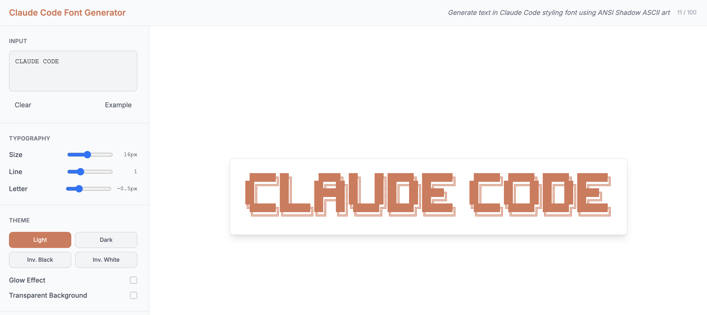

# Claude Code Font Generator

Generate text in the Claude Code styling font using ANSI Shadow ASCII art. Export as PNG, SVG, or text.

🔗 **Live Demo**: [claude-code-font-generator.pages.dev](https://claude-code-font-generator.pages.dev)



## Tech Stack

Next.js 15, TypeScript, Tailwind CSS

## Getting Started

```bash
npm install
npm run dev
```

Open http://localhost:3000

## Features

- Claude Code styling font (ANSI Shadow ASCII art)
- Multiple themes (light, dark, inverted)
- Glow effects and transparency
- Export: copy, TXT, PNG, SVG
- Typography controls

## Project Structure

```
src/
├── app/           # Next.js pages
├── components/    # React components  
├── lib/           # Font mapping logic
└── types/         # TypeScript types
```

## Scripts

- `npm run dev` - Development server
- `npm run build` - Production build
- `npm run lint` - ESLint

## Deployment

Hosted on Cloudflare Pages with automatic deployments from the main branch.

### Deploy to Cloudflare Pages

1. Connect your GitHub repo to Cloudflare Pages
2. Set build command: `npm run build`
3. Set output directory: `out`
4. Deploy!

## License

MIT License - see [LICENSE](LICENSE) file for details.